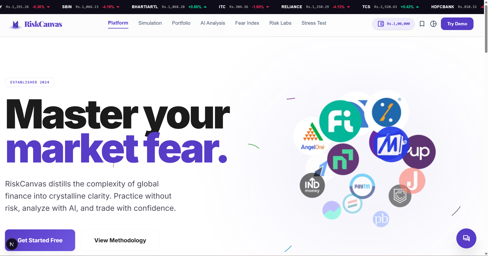

# 🎯 RiskCanvas
### AI-Powered Financial Simulator


> **Practice without risk. Analyze with AI. Trade with confidence.**

RiskCanvas bridges the gap between theoretical market education and real-world trading intuition. By combining live market data with Google Gemini AI, the platform lets users simulate high-leverage trades, experience real-time market fluctuations, and master risk management — without risking a single rupee.

---



---

## ✨ Features

### 📈 Stock Simulation Sandbox
The core trading engine for building hypothetical portfolios with real market behavior.
- Live tape movement simulation — execute BUY and SELL orders tracked against local persistence
- **Jitter Engine** — algorithmic price jitter updated every few seconds to emulate high-frequency market noise above the Yahoo Finance baseline
- Algorithmic search across global stocks and cryptocurrencies
- Max sizing calculator — dynamically computes maximum shares on margin relative to available buying power

### 💼 Live Portfolio Dashboard
Real-time command center for observing simulated capital.
- Realized and Unrealized P&L tracking, updated dynamically against the live data feed
- Sector breakdown — visualizes portfolio density across TECH, ENERGY, CRYPTO and more to reveal concentration risk

### 🤖 AI Risk Analysis *(Flagship Feature)*
One-click Gemini-powered algorithmic risk evaluator.
- Captures your active portfolio (leverage + specific assets) and injects it into a structured Gemini prompt
- Plain-English output — identifies hidden correlations, warns against over-leverage, grades portfolio resilience
- **PDF Export** — compiles the AI assessment into a downloadable business report via jsPDF

### 😨 Fear & Greed Index
Behavioral economics dashboard powered by live sentiment data.
- Fetches the global emotion score from Alternative.me in real time
- Gemini writes a tactical breakdown based on the exact day's score — *"Score is 12: Extreme Fear. Capital preservation is priority."*

### 💸 Loss Probability Calculator
Predictive downside visualization before taking a position.
- Input asset, position size, and leverage multiplier (e.g. 5x)
- Renders exact cash devastation at 10%, 20%, and 40% drawdown levels

### 🔥 Stress Test — Black Swan Emulator
Run your active portfolio through historical macro-shocks.
- 2008 Housing Crash scenario
- 2020 COVID Flash Crash scenario
- See potential drawdown limits before the market finds them for you

### 💬 StockAI Floating Chatbot
Omnipresent AI assistant available across all routes.
- Persistent across the entire platform — always accessible
- Context-aware — accesses both general market knowledge and live platform state, with no hallucination outside financial logic
- Powered by Google Gemini (`gemini-pro`)

---

## 🛠️ Tech Stack

| Layer | Technology |
|-------|-----------|
| **Framework** | Next.js 15 (App Router), React 19 |
| **Language** | TypeScript + JavaScript |
| **Styling** | Tailwind CSS v4, custom glassmorphism ("No-Line" design system) |
| **Typography** | Playfair Display + Inter |
| **Animations** | GSAP (GreenSock), Framer Motion, Lenis smooth scroll |
| **3D / Canvas** | Three.js, @react-three/fiber, @react-three/drei |
| **AI** | Google Gemini API (`gemini-pro`) via `@google/generative-ai` |
| **Compiler** | Next.js 15 Turbopack |
| **Export** | jsPDF — client-side PDF report generation |

---

## 📡 API Integrations

| API | Endpoint | Purpose |
|-----|---------|---------|
| **Yahoo Finance** | `/api/yahoo` (internal Next.js proxy) | Live intraday ticker metrics + 30-day historical chart data |
| **Alternative.me** | `api.alternative.me/fng/` | Daily Fear & Greed sentiment score (0–100) |
| **ExchangeRate API** | `api.exchangerate-api.com/v4/latest/USD` | Live USD → INR conversion for all global assets |
| **Google Gemini** | `@google/generative-ai` | AI risk analysis, sentiment translation, chatbot |

---

## 🚀 Getting Started

### Prerequisites

- **Node.js** 18 or higher
- **npm** or **yarn**
- A free **Gemini API key** from [Google AI Studio](https://aistudio.google.com/)

### 1. Clone the Repository

```bash
git clone https://github.com/EklavyaAhuja/RiskCanvas.git
cd RiskCanvas
```

### 2. Install Dependencies

```bash
npm install
```

### 3. Set Up Environment Variables

```bash
cp .env.example .env
```

Open `.env` and fill in your Gemini API key:

```env
NEXT_PUBLIC_GEMINI_API_KEY=your_gemini_api_key_here
```

> Get your free API key at [aistudio.google.com](https://aistudio.google.com/) → Create API Key

The ExchangeRate and Fear & Greed endpoints are pre-filled in `.env.example` — no additional keys needed.

### 4. Run the Development Server

```bash
npm run dev
```

Open [http://localhost:3000](http://localhost:3000) in your browser.

### 5. Build for Production

```bash
npm run build
npm run start
```

---

## 🔑 Environment Variables

| Variable | Description | Required |
|----------|-------------|----------|
| `NEXT_PUBLIC_GEMINI_API_KEY` | Google Gemini API key — powers all AI features | ✅ Yes |
| `NEXT_PUBLIC_EXCHANGE_RATE_API` | ExchangeRate API endpoint (pre-filled) | ✅ Yes |
| `NEXT_PUBLIC_FNG_API` | Fear & Greed API endpoint (pre-filled) | ✅ Yes |

---

## 📁 Project Structure

```
riskcanvas/
├── app/                    # Next.js App Router pages + API routes
│   └── api/yahoo/          # Internal Yahoo Finance proxy (CORS bypass)
├── components/             # React components
│   ├── ui/                 # Base UI components
│   ├── StockSimulator/     # Trading engine + jitter system
│   ├── Portfolio/          # Live portfolio dashboard
│   ├── FearGreed/          # Fear & Greed index + AI translation
│   ├── StressTest/         # Black Swan emulator + loss calculator
│   └── ChatBot/            # StockAI floating chatbot
├── public/                 # Static assets
│   └── methodology.mp4     # AI methodology explainer video
├── .env                    # Local environment variables (gitignored)
├── .env.example            # Environment variable template
└── README.md
```

---

## 🗺️ Future Roadmap

| Phase | Feature |
|-------|---------|
| **Post-MVP** | User authentication via NextAuth / Clerk |
| **Post-MVP** | PostgreSQL database (Prisma / Drizzle) for portfolio persistence |
| **Post-MVP** | WebSocket feeds replacing the jitter engine with true Level 2 market data |
| **Scale** | NSE/BSE stock universe expansion |
| **Scale** | White-label B2B product for brokers (Zerodha, Upstox, Groww) |

---

## 🎥 Demo

▶️ [Watch the demo video](https://www.youtube.com/watch?v=rFgqpPnLvLM)

> If Gemini API quota is exceeded during judging, the demo video shows all AI features working live.

---

## 👥 Team

Built for the **Finvasia Innovation Hackathon 2026** — *Leveraging Emerging Trends and Technologies for Financial Innovation*

| Role | Responsibility |
|------|---------------|
| **Team Lead + Frontend** | Architecture, 3D visualizations, GSAP animations, Three.js globe |
| **AI Integration** | Gemini API — risk engine, sentiment analyzer, StockAI chatbot |
| **Data & APIs** | Yahoo Finance proxy, ExchangeRate, jitter engine, INR conversion |
| **UI/UX Design** | Glassmorphism design system, component library, editorial typography |

---

## 📄 License

MIT License — feel free to fork, learn from, and build on this project.

---

<p align="center">
  <strong>RiskCanvas</strong> — Master your market fear. 🎯
</p>
